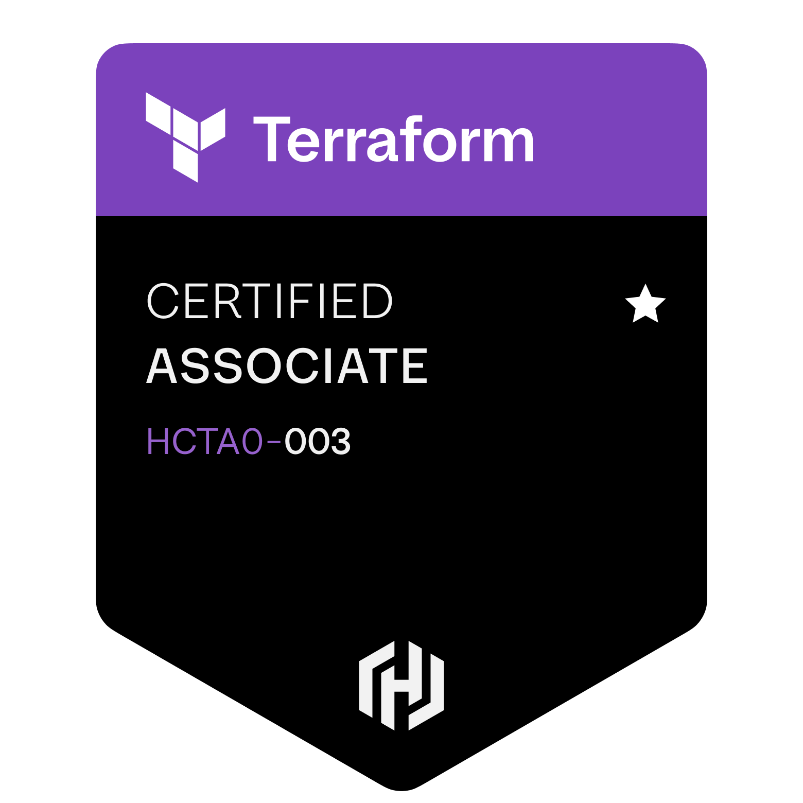

<p align="center">

</p>


```text
                                   -`                     am2998@github
                                  .o+`                    --------------------
                                 `ooo/                    $ whoami
                                `+oooo:                   Role: DevOps | Cloud Engineer
                               `+oooooo:                  Uptime: 27 years
                               -+oooooo+:                 Locale: it_IT.UTF-8 | en_US.UTF-8
                             `/:-:++oooo+:                Linkedin: www.linkedin.com/in/andrea-moscato
                            `/++++/+++++++:               --------------------
                           `/++++++++++++++:              $ echo $SKILLS
                          `/+++ooooooooooooo/`            Cloud: Azure
                         ./ooosssso++osssssso+`           Containers: Docker | Kubernetes
                        .oossssso-````/ossssss+`          IaC: Terraform
                       -osssssso.      :ssssssso.         CI/CD: Jenkins | GitHub Actions
                      :osssssss/        osssso+++.        Linux: Arch | ZFS | zsh
                     /ossssssss/        +ssssooo/-        --------------------
                   `/ossssso+/:-        -:/+osssso+-      $ ps aux
                  `+sso+:-`                 `.-/+oso:     Arch-btw: Arch + ZFS installer ISO
                 `++:.                           `-/+/    RAG-cli: RAG orchestrated by LangGraph
                 .`                                 `/    GitOps-Project: ArgoCD with K8S
```

## Certifications

<div>\
  
  
  
  
  
  
  
  
</div>

## Recent Commits

<!-- RECENT_COMMITS_START -->
<table width="100%" cellpadding="14" cellspacing="0">
  <tr>
    <td align="left" valign="top" width="20.00%">
      <b><a href="https://github.com/am2998/Arch-btw/commit/ccf78cb143f359f52e11487989b4b671c70894a4"><code>ccf78cb</code></a></b><br/>
      2026-02-18<br/>
      am2998/Arch-btw<br/><br/>
      <b>Add &#x27;ranger&#x27; to extra packages installation</b>
    </td>
    <td align="left" valign="top" width="20.00%">
      <b><a href="https://github.com/am2998/am2998/commit/ef354c240469e2005a6d59f33bb212bef20bd178"><code>ef354c2</code></a></b><br/>
      2026-02-17<br/>
      am2998/am2998<br/><br/>
      <b>Update README.md with personal information</b>
    </td>
    <td align="left" valign="top" width="20.00%">
      <b><a href="https://github.com/am2998/am2998/commit/2f47996aa709c5ddd22bd1ad9c1b228d2dfd4c14"><code>2f47996</code></a></b><br/>
      2026-02-17<br/>
      am2998/am2998<br/><br/>
      <b>Update skills command in README</b>
    </td>
    <td align="left" valign="top" width="20.00%">
      <b><a href="https://github.com/am2998/am2998/commit/77fc07ca17abdb00172d91432f2709f0a0b22de4"><code>77fc07c</code></a></b><br/>
      2026-02-17<br/>
      am2998/am2998<br/><br/>
      <b>Modify README with updated uptime and project info</b>
    </td>
    <td align="left" valign="top" width="20.00%">
      <b><a href="https://github.com/am2998/Arch-btw/commit/ac121f64be20c6a7ae72a71730512fc34a384f49"><code>ac121f6</code></a></b><br/>
      2026-02-17<br/>
      am2998/Arch-btw<br/><br/>
      <b>Update Quick Start section in README</b>
    </td>
  </tr>
</table>
<!-- RECENT_COMMITS_END -->
