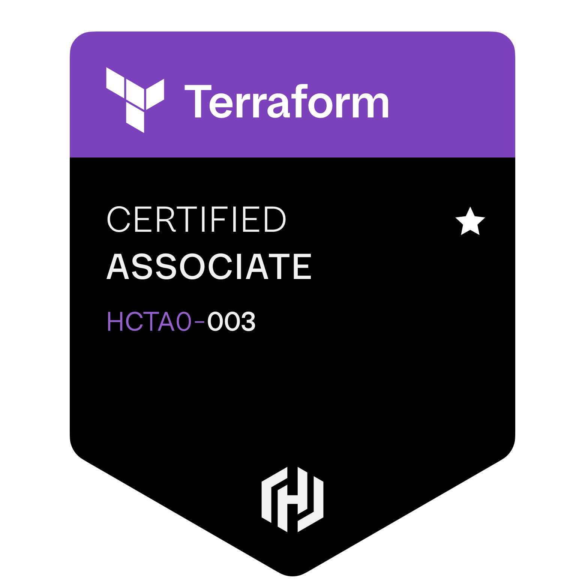
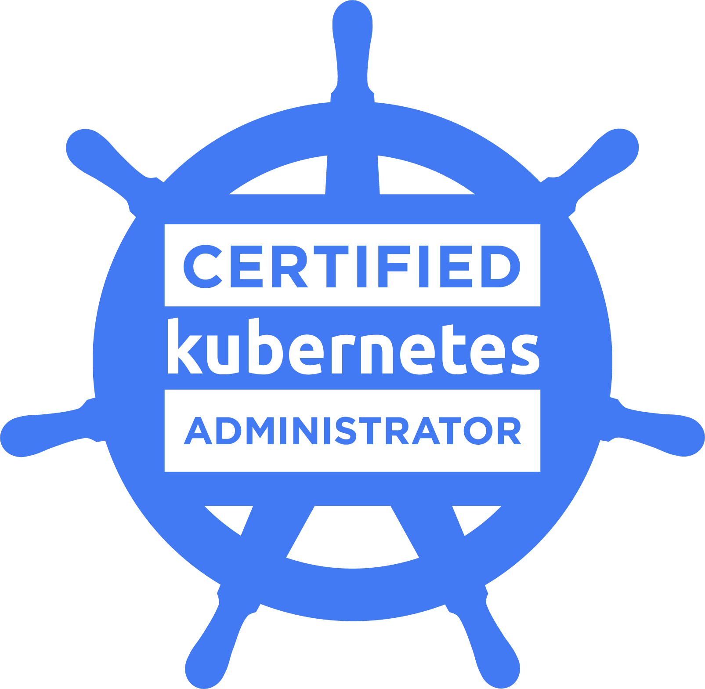

<pre>
    __          _ __    __       __                    __           __                     
   / /_  __  __(_) /___/ /      / /_  ________  ____ _/ /__        / /__  ____ __________  
  / __ \/ / / / / / __  /      / __ \/ ___/ _ \/ __ `/ //_/       / / _ \/ __ `/ ___/ __ \ 
 / /_/ / /_/ / / / /_/ /      / /_/ / /  /  __/ /_/ / ,< _       / /  __/ /_/ / /  / / / / 
/_.___/\__,_/_/_/\__,_(_)    /_.___/_/   \___/\__,_/_/|_(_)     /_/\___/\__,_/_/  /_/ /_(_)
                                         
</pre>

## Technologies

  
  
  
  
  
  
  
  
  
  
  
  

  
  
  
  
  
  
  
  

## Certifications

  
  
  
  
  
  
  
  

## Recent Commits

<!-- RECENT_COMMITS_START -->
<table width="100%" cellpadding="14" cellspacing="0">
  <tr>
    <td align="left" valign="top" width="20.00%">
      <b><a href="https://github.com/am2998/am2998/commit/95cd0ad0c3e5e3c30137b27c3136d1e5afece62d"><code>95cd0ad</code></a></b> 
      am2998/am2998  
      <b>chore: update README</b>
    </td>
    <td align="left" valign="top" width="20.00%">
      <b><a href="https://github.com/am2998/am2998/commit/808f6e9d4e3fdf071e81dbb66027fa953c03f65b"><code>808f6e9</code></a></b> 
      am2998/am2998  
      <b>chore: update README</b>
    </td>
    <td align="left" valign="top" width="20.00%">
      <b><a href="https://github.com/am2998/am2998/commit/99d7a770f2f96e29a836cc6f4f91e4ecedac6757"><code>99d7a77</code></a></b> 
      am2998/am2998  
      <b>chore: update README</b>
    </td>
    <td align="left" valign="top" width="20.00%">
      <b><a href="https://github.com/am2998/am2998/commit/94b6f166706529794a27a668155f3387790f6b6d"><code>94b6f16</code></a></b> 
      am2998/am2998  
      <b>chore: update README</b>
    </td>
    <td align="left" valign="top" width="20.00%">
      <b><a href="https://github.com/am2998/am2998/commit/14c7e2b3258c1fed98b41aa3b0986a7617b94f6d"><code>14c7e2b</code></a></b> 
      am2998/am2998  
      <b>chore: update README</b>
    </td>
  </tr>
</table>
<!-- RECENT_COMMITS_END -->
