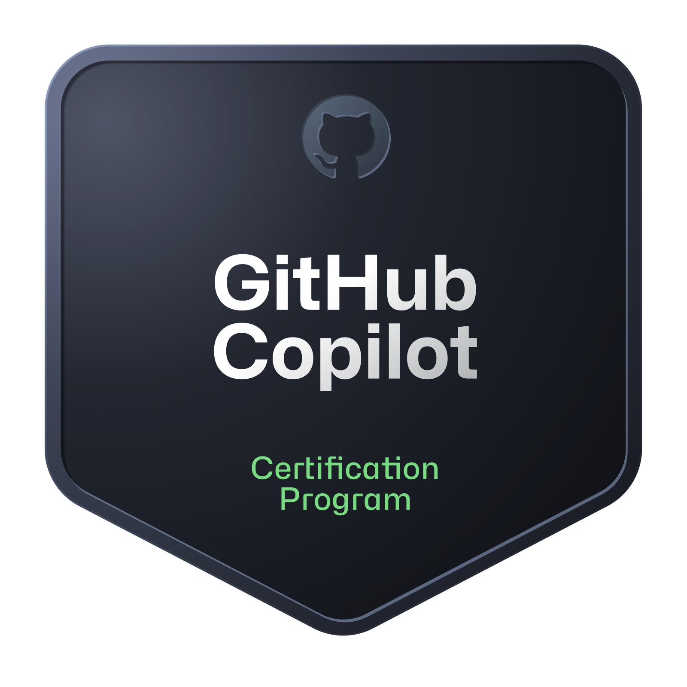

## Certifications

  
  
  
  
  
  
  
  

## Recent Commits

<!-- RECENT_COMMITS_START -->
<table width="100%" cellpadding="14" cellspacing="0">
  <tr>
    <td align="left" valign="top" width="20.00%">
      <b><a href="https://github.com/am2998/am2998/commit/a5dfc6486c5a9b68afce3a1b34789e49f3d27190"><code>a5dfc64</code></a></b> 
      am2998/am2998  
      <b>chore: update README</b>
    </td>
    <td align="left" valign="top" width="20.00%">
      <b><a href="https://github.com/am2998/am2998/commit/ca8a0718d3fdfddeca5c3d0594dbeeea4c0e74cb"><code>ca8a071</code></a></b> 
      am2998/am2998  
      <b>Remove ASCII art section from README</b>
    </td>
    <td align="left" valign="top" width="20.00%">
      <b><a href="https://github.com/am2998/am2998/commit/a06844ca7256624a0daa80139ac7de06c10f3a7a"><code>a06844c</code></a></b> 
      am2998/am2998  
      <b>Enhance README with ASCII art</b>
    </td>
    <td align="left" valign="top" width="20.00%">
      <b><a href="https://github.com/am2998/am2998/commit/b1d73a96287ebc2dc7834705ee1647557980b2ee"><code>b1d73a9</code></a></b> 
      am2998/am2998  
      <b>chore: update README</b>
    </td>
    <td align="left" valign="top" width="20.00%">
      <b><a href="https://github.com/am2998/am2998/commit/e0d330fb852ec6ea3911273a408bdc691112cfdd"><code>e0d330f</code></a></b> 
      am2998/am2998  
      <b>chore: update README</b>
    </td>
  </tr>
</table>
<!-- RECENT_COMMITS_END -->
